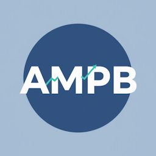
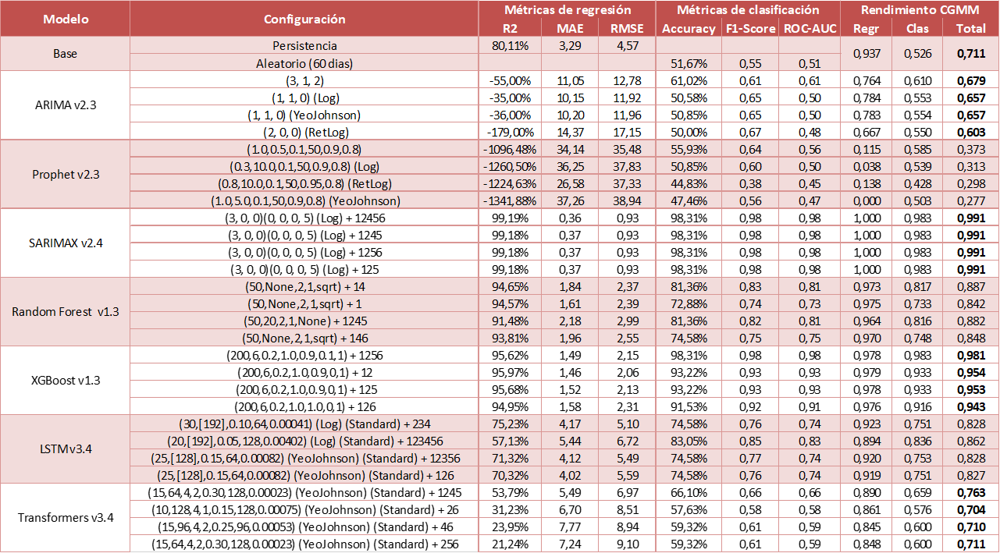
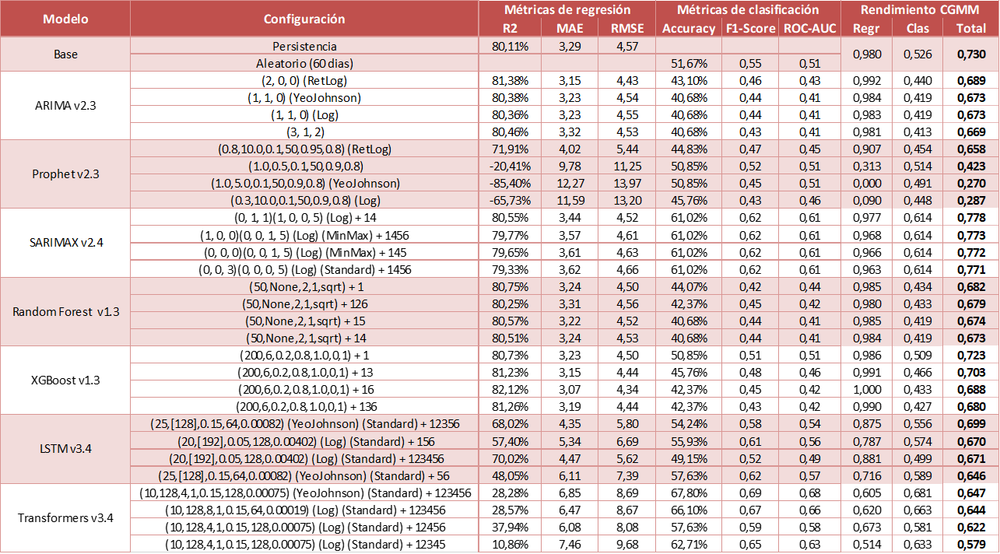

# ANÁLISIS DE MODELOS PREDICTIVOS EN BOLSA (AMPB)  
<div>
  
  
  <h3 align="center">MSRPP</h3>
  <p align="center"><b>Copyright (C) 2024-2025 MegaStorm Systems</b></p>
</div>
<br clear="both" />

---

## 📌 Descripción del proyecto  
Este proyecto se sitúa en la intersección entre inteligencia artificial y análisis financiero, nacido de una inquietud personal y como parte de un trabajo fin de máster en Big Data. El objetivo es explorar si los métodos estadísticos clásicos y las técnicas modernas de machine learning y deep learning pueden superar la aparente aleatoriedad de los mercados bursátiles.
El foco está en NVIDIA (NVDA) y la comparación sistemática de distintos modelos predictivos y conjuntos de datos, con la meta de identificar la combinación más eficaz para la predicción diaria del precio de cierre.

El resultado final incluye tablas comparativas que recogen el rendimiento de más de 2.200 pruebas y una aplicación de simulación que, sobre un intervalo histórico de dos meses, combina los tres mejores modelos (mejor global, mejor en regresión y mejor en clasificación) y ofrece un pequeño simulador de broker para ejecutar operaciones de compra/venta ficticias y evaluar de forma práctica el sistema desarrollado.
 

### Características principales  
- **Modelos evaluados**:  
  - Estadísticos: ARIMA, Prophet, SARIMAX  
  - Machine Learning: Random Forest, XGBoost  
  - Deep Learning: LSTM, Transformer (encoder)  

- **Datos utilizados** (2015–2025):  
  - Series históricas OHLCV de NVIDIA  
  - Indicadores técnicos (SMA, EMA, RSI, MACD, Bollinger, etc.)  
  - Cotizaciones de Big Tech (Google, Amazon, Apple, Meta, Microsoft, Tesla, AMD, Intel)  
  - Índices bursátiles globales (S&P 500, NASDAQ-100, EuroStoxx50, Nikkei 225, Shanghai Composite)  
  - Indicadores económicos (CPI, PIB real, Treasury Yield, VIX, petróleo, oro, etc.)  
  - Análisis de sentimiento (Google Trends, Reddit, Alpha Vantage news)  

- **Orquestador automático**: ejecuta todas las combinaciones de modelos y datasets con capacidad de reinicio y recogida sistemática de resultados.  

- **Volumen de experimentación**:  
  - 63 combinaciones de conjuntos de datos  
  - Más de **2.200 tests completos**  
  - Millones de configuraciones de hiperparámetros probadas en total  

- **Tecnologías empleadas**:  
  - Python (scikit-learn, TensorFlow, statsmodels, XGBoost, Optuna, etc.)  
  - MongoDB como *data warehouse* ligero  
  - Jupyter Notebook para experimentación  
  - Docker + Flask para la aplicación de simulación  
  - Orquestación con `docker-compose` 
  
---

## 🗂️ Estructura del repositorio 
```
AMPB/
├── AMPBLib/                            # Módulo Python con funciones auxiliares
│
├── App/                                # Aplicación web de simulación
│ ├── Dockerfile.ampb                   # Dockerfile para desplegar la aplicación
│ ├── AMPB-Sim.py                       # Script principal de la aplicación Flask
│ ├── AMPB-Sim_requirements.txt         # Dependencias de Python de la aplicación
│ ├── model_preds/                      # Predicciones generadas por los modelos
│ ├── static/                           # Archivos estáticos (CSS, JS, imágenes)
│ ├── templates/                        # Plantillas HTML para la interfaz web
│ ├── ssl_certs/                        # Certificados SSL
│ └── NVDA_2015-01-05_2025-05-23_SA.csv # Dataset con análisis de sentimiento
│
├── MongoDB/                            # Base de datos MongoDB (data warehouse ligero)
│
├── Notebook/                           # Jupyter Notebooks de modelos y preprocesamiento
│ ├── Preprocesamiento de datos.ipynb   # Limpieza y preparación de datos
│ ├── Orquestador.ipynb                 # Coordinador de entrenamiento y evaluación
│ ├── Predictor Persistencia.ipynb      # Baseline: persistencia
│ ├── Predictor Aleatorio.ipynb         # Baseline: aleatorio
│ ├── Predictor ARIMA.ipynb             # Modelo ARIMA
│ ├── Predictor SARIMAX.ipynb           # Modelo SARIMAX
│ ├── Predictor Random Forest.ipynb     # Modelo Random Forest
│ ├── Predictor XGBoost.ipynb           # Modelo XGBoost
│ ├── Predictor LSTM.ipynb              # Modelo LSTM
│ ├── Predictor Transformer.ipynb       # Modelo Transformer
│ ├── Predictor Prophet.ipynb           # Modelo Prophet
│ ├── Preprocesamiento de datos.csv     # Datos preprocesados
│ ├── NVDA_2015-01-05_2025-05-23_SA.csv # Dataset completo con sentimiento
│ └── Requirements.txt                  # Dependencias de los modelos
│
├── Resultados/                         # Resultados de todos los modelos (~2.280 pruebas)
│
├── Scripts/                            # Scripts de recogida y análisis de datos
│ ├── Dockerfile.python                 # Dockerfile para entorno de recolección de datos
│ ├── GetData_requirements.txt          # Dependencias para obtención de datos
│ ├── GetDataAV.py                      # Datos de Alpha Vantage
│ ├── GetDataAV_SA.py                   # Análisis de sentimiento con Alpha Vantage
│ ├── GetDataYF.py                      # Datos de Yahoo Finance
│ ├── GetDataYF_SA.py                   # Análisis de sentimiento con Yahoo Finance
│ ├── GetDataRD_SA.py                   # Análisis de sentimiento con Reddit
│ ├── GetData_cron                      # Configuración cron de recolección automática
│ ├── SA_Analyzer.py                    # Script de análisis de sentimiento
│ ├── SA-GetAnalyzer_requirements.txt   # Dependencias del análisis de sentimiento
│ ├── SA-Analyzer_cron                  # Cron para análisis automático
│ └── entrypoint.sh                     # Script de inicio para contenedores
│
├── docker-compose.yml                  # Orquestador de contenedores Docker
└── README.md                           # Información general del proyecto
```

---

## 🛠️ Instalación y uso  

### 1. Clonar el repositorio  
```bash
git clone https://github.com/RPP-dev/AMPB
cd AMPB
```

### 2. Despliegue con Docker
Desde la raíz del proyecto:
```bash
docker-compose -p tfm_ampb up -d  
```
Esto levantará 4 contenedores interconectados:
- **app-sim**: Python 3.12 + Flask. Sirve la aplicación de simulación.
- **financedb**: MongoDB protegido con usuario y contraseña.
- **getdata**: Scripts de recogida de datos + cron diarios automáticos.
- **sa-analyzer**: Procesa noticias con FinBERT y genera métricas de sentimiento.	

Las librerías necesarias se instalan automáticamente, así como cualquier configuración necesaria.

### 3. Configuración de credenciales
Editar AMPBLib/ampblib/__init__.py y completar la sección "Credenciales" para:
- Alpha Vantage
- Reddit

(Este paso no es necesario si solo se quiere ejecutar la aplicación de simulación).

---

## ▶️ Ejecución de la aplicación de simulación
Abrir en navegador:
👉 http://localhost:5000

Credenciales iniciales:
- Usuario: admin
- Contraseña: UEMRPP

---

## 📈 Ejecución de modelos predictivos y orquestador	  
Requisitos: Python 3.12 + Jupyter Notebook.
```bash
# Instalar dependencias
cd Notebook
pip install -r requirements.txt

# Instalar la librería AMPBLib
cd ../AMPBLib
pip install -e .
```
Abrir los notebooks de modelos y orquestador desde Jupyter.

---

## 📊 Resultados simplificados

Los resultados, comparados con el predictor base, muestran que en condiciones realistas de backtesting el modelo **SARIMAX** ofrece el mejor rendimiento global: empata en regresión y mejora un **17% en clasificación**. De forma aislada:  
- En regresión, **XGBoost** mejora un +2%.  
- En clasificación, **Transformer** alcanza un +30%.  

En cuanto a los datos, los más relevantes resultaron ser los **directos (OHLCV)**, seguidos del **análisis de sentimiento** y los **indicadores económicos**, después los **índices bursátiles** y, en último lugar, los **indicadores técnicos** y las **Big Tech**.  

**Validación estática (idealizada):**  
  

**Backtesting (realista):**  
  

